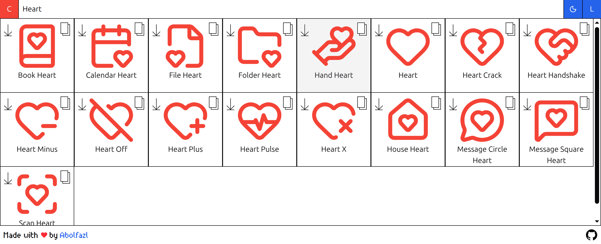
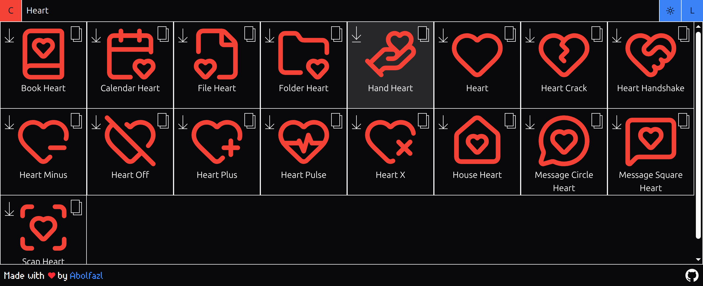

<h1 align="center">🔍 Icon Packs</h1>

<p align="center">
  
  
</p>

<p align="center">
  Search across multiple icon packs instantly — find the right icon by name, filter by pack, and customize colors.
</p>

<p align="center">
  
  
</p>

---

## 🚀 Quick Start

```bash
git clone https://hamgit.ir/abolraj/icon-packs.git
cd icon-packs
pnpm install
pnpm run dev
```

---

## 📖 Usage

Just type a keyword — the app instantly searches across all available icon packs and shows matching icons. Pick your pack, choose a color, and grab the icon you need.

---

## ✨ Features

- 🔎 **Search** icons by name across all packs
- 📦 **Pick your icon pack** — filter by your preferred pack
- 🎨 **Custom color** — change icon color on the fly
- 🌗 **Dark / Light theme** — toggle to match your mood
- ⚡ **Blazing fast** — virtualized list and background search

### Supported Icon Packs

| Pack | Source |
|------|--------|
| Lucide | [lucide.dev](https://lucide.dev) |
| Phosphor | [phosphoricons.com](https://phosphoricons.com) |
| Heroicons | [heroicons.com](https://heroicons.com) |
| Simple Icons React | [simpleicons.org](https://simpleicons.org) |
| Bootstrap Icons | [icons.getbootstrap.com](https://icons.getbootstrap.com) |
| Font Awesome | [fontawesome.com](https://fontawesome.com) |
| Material Icons | [fonts.google.com/icons](https://fonts.google.com/icons) |
| Ant Design Icons | [ant.design/components/icon](https://ant.design/components/icon) |

---

## ⚙️ How It Works

### Tech Stack

- **React v19** — UI library
- **Vite v8** — build tool
- **Tailwind CSS v4** — utility-first styling

### Project Structure

```
src/components/packs/
├── lucide/
│   ├── Worker.ts          # Handles search logic off the main thread
│   ├── Loader.ts          # Loads icons with pack-specific logic
│   └── LucideList.tsx     # Renders the virtualized icon list
├── heroicons/
│   ├── Worker.ts
│   ├── Loader.ts
│   └── HeroiconsList.tsx
└── simple-react-icons/
    ├── Worker.ts
    ├── Loader.ts
    └── SimpleReactIconsList.tsx
```

**Each pack folder contains three core files:**

- **Worker.ts** — Offloads search computations to a Web Worker, keeping the UI thread free for smooth interactions.
- **Loader.ts** — Each pack has its own loading mechanism, isolated in its own loader script.
- **[Pack]List.tsx** — Ties the Worker and Loader together, rendering icons in a virtualized grid.

### Shared Components

- `ColorPicker` — choose any color for icons
- `Search` — the main search input
- `ThemePicker` — toggle dark/light mode
- `IconPicker` — select active icon pack
- `VirtualList` — renders only visible DOM nodes for performance
- `Copy` — the component used in icon items for copying
- `Download` — the component used in icon items for downloading
- `Loader` — the component used for loading

### Shared Utilities

Located in `src/shared/`:
- `useCopyToClipboard` — copy icon code with one click
- `useDownloadSVG` — download icons as SVG files

---

## 🤝 Contributing

Contributions are welcome! The best way to improve this project is by **adding new icon packs**.

To add a new pack:
1. Create a folder under `src/components/packs/[your-pack-name]/`
2. Add the three required files: `Worker.ts`, `Loader.ts`, and `[Pack]List.tsx`
3. Register your pack in the main `IconPicker` component
4. Open a PR — I'd love to see what you add!

For bugs, ideas, or questions, feel free to open an issue.

---

## 👤 About Me

**Abolfazl Rajaee** — Fullstack Laravel Web Developer  
🌐 [abolfazlrajaee.ir](https://abolfazlrajaee.ir)  
🐙 [github.com/abolraj](https://github.com/abolraj)
🐙 [hamgit.ir/abolraj](https://github.com/abolraj)

---

## 📄 License

MIT — feel free to use, modify, and share. [Here](./LICENCE).
